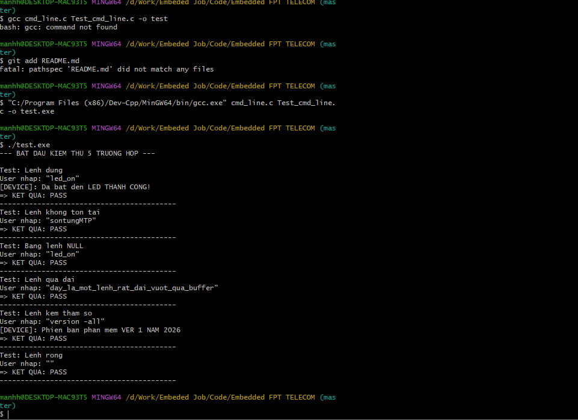

1. Cấu trúc thư mục
Dự án bao gồm :

cmd_line.h: Định nghĩa cấu trúc cmd_line_t, các mã lỗi (CMD_SUCCESS, CMD_NOT_FOUND,...) và các nguyên mẫu hàm.
cmd_line.c: Chứa logic tách từ khóa lệnh và duyệt bảng để so khớp lệnh.
Test_cmd_line.c: Chứa hàm main, các hàm xử lý thiết bị (led_on, version) và bộ chạy Unit Test tự động.

3. Các kịch bản kiểm thử (Unit Test)
Chương trình đã vượt qua 5 bài kiểm tra quan trọng:

Lệnh đúng (CMD_SUCCESS): Kiểm tra với lệnh led_on.
Lệnh sai (CMD_NOT_FOUND): Kiểm tra khi nhập một lệnh không tồn tại trong bảng.
Bảng lệnh rỗng (CMD_TBL_NOT_FOUND): Kiểm tra tính an toàn khi bảng lệnh bị NULL.
Lệnh quá dài (CMD_TOO_LONG): Kiểm tra khả năng chống tràn bộ nhớ đệm (buffer).
Lệnh kèm tham số: Đảm bảo parser tách được từ khóa lệnh ngay cả khi có tham số đi kèm phía sau.

4.Lệnh Run 

gcc cmd_line.c Test_cmd_line.c -o test_app

5. Hình ảnh đã chạy thành công

